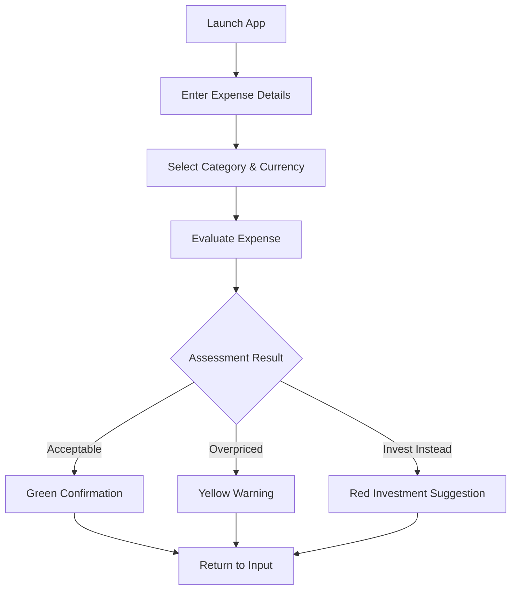

# Arri - Smart Expense Advisor

> *Intelligent expense evaluation with real-time currency conversion and personalized financial guidance*

**Swift Student Challenge 2025 Submission**

A SwiftUI-based iOS application that provides intelligent expense assessment through category-based evaluation, real-time currency conversion, and personalized financial recommendations. Developed for Swift Student Challenge 2025 submission.

## 📱 Application Overview

Arri transforms how users approach expense decisions by combining smart categorization, real-time exchange rates, and thoughtful financial guidance. The app evaluates expenses against category-specific thresholds and provides actionable recommendations to promote mindful spending habits.

## ✨ Core Features

- **Smart Expense Evaluation** - Category-based assessment with intelligent thresholds
- **Real-time Currency Conversion** - Live USD-to-INR exchange rate integration
- **Personalized Recommendations** - Tailored advice based on expense patterns
- **Glassmorphism UI** - Modern, translucent design elements throughout
- **Multi-category Support** - Food, Transportation, Entertainment, Utilities, Shopping, and Others
- **Investment Guidance** - Suggests alternatives for high-value expenses

## 🛠️ Technical Architecture

### SwiftUI Framework Implementation
- **Model-View-ViewModel (MVVM)** - Clean separation of concerns
- **ObservableObject** - Reactive state management with `@Published` properties
- **Async/Await** - Modern concurrency for API calls
- **Custom ViewModifiers** - Reusable glassmorphism effects
- **NavigationLink** - Seamless view transitions

### Financial Intelligence System
```swift
// Core expense evaluation categories
Food, Transportation, Entertainment, Utilities, Shopping, Other

// Assessment types
.acceptable(String)     // Within reasonable spending range
.overpriced(String)     // Moderately high, suggests alternatives
.investForFuture(String) // Significantly high, recommends investment
```

### Real-time Data Integration
- **Exchange Rate API** - Live USD-to-INR conversion
- **URLSession** - Asynchronous network requests
- **JSON Parsing** - Dynamic rate updates
- **Error Handling** - Graceful fallback for network failures

## 🎨 User Interface Design

### Visual Design Elements
- **Angular Gradient Background** - Dynamic color transitions (Blue → Purple → Pink → Orange)
- **Glassmorphism Effects** - Translucent cards with blur effects
- **SF Symbols Integration** - Native iOS iconography
- **Responsive Layout** - Adaptive design for various screen sizes

### User Experience Flow
1. **Expense Input** - Name, amount, category, and currency selection
2. **Smart Evaluation** - Real-time assessment against category thresholds
3. **Visual Feedback** - Color-coded results with actionable recommendations
4. **Navigation** - Smooth transitions between input and assessment views

## 📁 Project Structure

```swift
Arri/
├── ContentView.swift           # Main application interface
├── Models/
│   ├── ExpenseItem            # Data model for expense entries
│   └── ExpenseAssessment      # Enum for evaluation results
├── ViewModels/
│   └── ExpenseViewModel       # Business logic and state management
├── Views/
│   ├── AssessmentView         # Results display interface
│   └── GlassEffectModifier    # Custom UI modifier
└── Utilities/
    └── Currency conversion    # Exchange rate functionality
```

## 🚀 Key Technical Highlights

### Modern Swift Features
- **@MainActor** - UI thread safety for view model operations
- **@StateObject** - Automatic view updates on state changes
- **@FocusState** - Keyboard management for text fields
- **Task/await** - Asynchronous programming patterns

### Financial Algorithm
```swift
// Dynamic threshold calculation
let adjustedThreshold = baseThreshold * conversionRate

// Three-tier assessment system
if amount < adjustedThreshold { .acceptable }
else if amount < (adjustedThreshold * 2) { .overpriced }
else { .investForFuture }
```

### API Integration
- **RESTful API consumption** for real-time exchange rates
- **Error-resilient networking** with fallback mechanisms
- **JSON data parsing** for dynamic rate updates

## 🎯 Swift Student Challenge 2025

### Submission Highlights
- **Original Concept** - Unique approach to expense management
- **Technical Excellence** - Modern SwiftUI implementation with advanced features
- **User-Centered Design** - Intuitive interface promoting financial awareness
- **Real-world Application** - Practical solution for everyday expense decisions

### Educational Value
Demonstrates mastery of:
- SwiftUI framework and design patterns
- Asynchronous programming and networking
- Custom UI components and modifiers
- Financial data processing and evaluation

## 🔄 App Workflow



## 💡 Innovation Features

### Intelligent Categorization
- **Essential vs. Discretionary** - Different evaluation criteria for necessities
- **Cultural Adaptation** - Currency-specific threshold adjustments
- **Future Planning** - Investment recommendations for large expenses

### Technical Innovation
- **Real-time Data** - Live exchange rate integration
- **Glassmorphism UI** - Modern iOS design language implementation
- **Responsive Feedback** - Immediate visual and textual guidance

## ⚖️ Copyright & Usage Notice

**STRICTLY CONFIDENTIAL - SWIFT STUDENT CHALLENGE 2025 SUBMISSION**

**Original Work:** This application represents original work created specifically for Swift Student Challenge 2025. **ALL CODE, CONCEPTS, ALGORITHMS, AND DESIGNS ARE STRICTLY PROTECTED INTELLECTUAL PROPERTY.**

**PROHIBITED USES:**
- ❌ **NO REPRODUCTION** of any code, design, or concept
- ❌ **NO DISTRIBUTION** in any form or format
- ❌ **NO MODIFICATION** or derivative works
- ❌ **NO COMMERCIAL USE** under any circumstances
- ❌ **NO EDUCATIONAL USE** without explicit permission
- ❌ **NO FORKING** or repository cloning
- ❌ **NO REVERSE ENGINEERING** or analysis
- ❌ **NO SUBMISSION** to any other competitions or challenges

**VIEWING ONLY:**
- This repository is shared solely for **portfolio demonstration purposes**
- Code viewing is permitted for **assessment and review only**
- **NO PERMISSION** is granted for any use beyond viewing

**COPYRIGHT PROTECTION:**
- **All Rights Reserved** - No license of any kind is granted
- **Swift Student Challenge 2025** submission material
- **Protected under copyright law** and competition regulations
- **Unauthorized use may result in competition violations**

**CONTACT:**
For any inquiries regarding this Swift Student Challenge 2025 submission:
- **Vishesh Singh Rajput (specstan)** - [eruditevsr@gmail.com](mailto:eruditevsr@gmail.com)

**⚠️ WARNING: This code is submitted for Swift Student Challenge 2025. Any unauthorized use, reproduction, or distribution is strictly forbidden and may violate competition integrity rules.**

---

*Created with passion for Swift Student Challenge 2025 - Demonstrating innovation in iOS development and financial technology*
